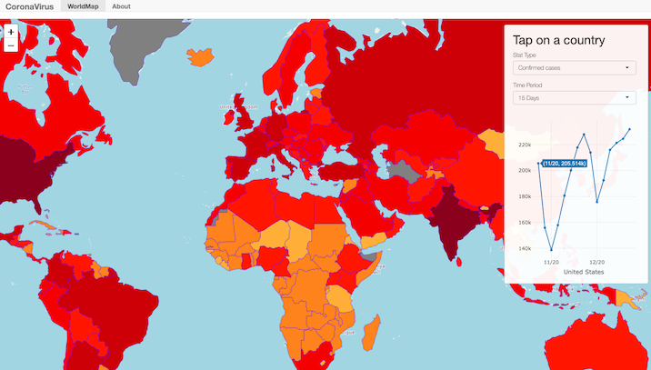

# COVID19 Tracker

This is a simple Shiny app visualizing Covid19 case, death and recovery numbers on an interactive World choropleth map. It uses Johns Hopkins University [dataset](https://github.com/CSSEGISandData/COVID-19).

Type of statistics and time period can be chosen via the control panel.

Tapping/Clicking on a country triggers an interactive [Leaflet](https://rstudio.github.io/leaflet/) plot of chosen stats below the input lists.

The app can be viewed at [here](https://hhekim.shinyapps.io/Covid19/).

